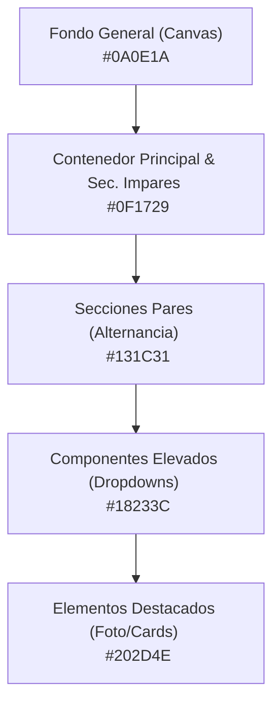

# 🎨 Paleta de Colores Oficial — Marca Personal Daniel Molina

Este documento detalla la **paleta de colores premium y la escala de profundidad** utilizada en la landing page del portafolio. Ha sido diseñada con una estética de "Fintech Dashboard & Premium Dark Tech" para transmitir analítica avanzada, solidez económica y modernidad tecnológica.

---

## 🚀 1. Degradado de Marca (Computación e Interactividad)
Es el gradiente dinámico central que guía la atención del usuario hacia los llamados a la acción, botones principales, hovers y detalles icónicos. 

Establece una progresión que va desde el azul oscuro profundo hasta un cian de alto contraste:

| Tonalidad | Código Hex | Color RGB | Variable CSS | Aplicación principal |
| :--- | :--- | :--- | :--- | :--- |
| **Azul Oscuro (Inicio)** | `#1E40AF` | `rgb(30, 64, 175)` | `--color-violet` | Inicio de degradado, glows decorativos |
| **Azul Medio (Medio)** | `#2563EB` | `rgb(37, 99, 235)` | `--color-primary` | Acento principal, enlaces, botones secundarios |
| **Cian Tecnológico (Fin)**| `#06B6D4` | `rgb(6, 182, 212)` | `--color-cyan` | Fin de degradado, textos destacados, hovers |

* **Gradiente Lineal CSS**: 
  `linear-gradient(135deg, #1E40AF 0%, #2563EB 50%, #06B6D4 100%)`

---

## 🌌 2. Escala de Superficies (Estructura y Profundidad)
Para evitar que el sitio web se vea plano o monótono, se estructuró una escala de superficies en tonos azules muy oscuros que simulan capas tridimensionales:

| Capa | Código Hex | Nombre Técnico | Variable CSS | Uso en la Landing |
| :--- | :--- | :--- | :--- | :--- |
| **Capa 0: Fondo General** | `#0A0E1A` | *Night Blue Base* | `--color-bg-body` | Fondo del lienzo completo (`html` y `body`). |
| **Capa 1: Contenedor Base**| `#0F1729` | *Deep Slate Blue* | `--color-surface-1` | Fondo de la estructura `.vcard-layout` y de las secciones impares (*Hero, Servicios, Precios, Contacto*). |
| **Capa 1.5: Alterno** | `#131C31` | *Mid Night Blue* | `--color-surface-1-alt` | Fondo de secciones pares (*Sobre Mí, Mi Método, Datos Clave, Portafolio*) para marcar ritmo sin líneas divisoras. |
| **Capa 2: Elevado** | `#18233C` | *Elevated Surface* | `--color-surface-2` | Menú desplegable superior (dropdowns) y fondo del menú colapsable en móvil. |
| **Capa 3: Destacado** | `#202D4E` | *Highlight Surface* | `--color-surface-3` | Fondo interior de la foto de perfil y tarjeta central destacada de precios. |

---

## 📇 3. Elementos Flotantes (Tarjetas y Formularios)
Para las tarjetas de contenido y los inputs de formulario se utiliza una capa translúcida azulada que absorbe el color del fondo sobre el que se encuentra apoyada:

*   **Fondo de Tarjeta Normal (`var(--color-card-bg)`)**:
    *   **RGBA**: `rgba(19, 27, 46, 0.55)`
    *   **Uso**: Tarjetas de "Sobre Mí" (highlights y filosofía), "Mi Método", "Lo Que Hago" (Servicios), "Datos Clave" (contadores) e ítems del "Portafolio".
*   **Fondo de Tarjeta en Hover / Input Enfocado (`var(--color-card-bg-hover)`)**:
    *   **RGBA**: `rgba(26, 37, 64, 0.80)`
    *   **Uso**: Resalte al pasar el cursor sobre las tarjetas y campos de texto del formulario de contacto activos.
*   **Borde Ultrafino de Tarjeta (`var(--color-card-border)`)**:
    *   **RGBA**: `rgba(255, 255, 255, 0.06)`
    *   **Uso**: Borde de 1px sutil para delimitar las tarjetas contra fondos oscuros.

---

## 📝 4. Colores de Texto (Contraste Editorial)
Para garantizar la legibilidad óptima (cumpliendo con las directrices de accesibilidad WCAG) en pantallas OLED o LCD oscuras:

*   **Títulos de Alto Impacto (`--color-text-title`)**:
    *   **Hex**: `#F9FAFB` (Blanco puro satinado)
    *   **Uso**: Títulos principales (`h1` a `h6`) y textos destacados.
*   **Cuerpo de Texto Legible (`--color-text-body`)**:
    *   **Hex**: `#E5E7EB` (Gris claro premium de la marca)
    *   **Uso**: Párrafos, textos de descripción y etiquetas de formulario.
*   **Textos Atenuados (`--color-text-muted`)**:
    *   **Hex**: `#9CA3AF` (Gris medio atenuado)
    *   **Uso**: Subtítulos, fechas, tags de tecnología y textos secundarios.

---

## 🟢 5. Color de Éxito / Acento Terciario
*   **Verde Esmeralda (`--color-accent`)**:
    *   **Hex**: `#10B981`
    *   **RGB**: `rgb(16, 185, 129)`
    *   **Uso**: Badges de proyectos terminados, alertas de validación exitosa (envío correcto de formulario) e iconos de aprobación.

---

## 💡 Guía Práctica de Uso en Otros Proyectos (Power BI, Streamlit, PDFs)
Si deseas replicar esta estética en tus reportes analíticos, presentaciones corporativas o dashboards en Python (Streamlit/Dash):

1.  **Fondo del Reporte**: Usa `#0A0E1A` como color de lienzo general.
2.  **Paneles y Contenedores**: Diseña los contenedores visuales principales de tus gráficos (las tarjetas de KPIs o gráficos) usando `#131C31`.
3.  **Bordes y Separadores**: Dibuja bordes muy delgados en `#1E293B` o con un cian translúcido (`rgba(6, 182, 212, 0.2)`).
4.  **Llamados a la Acción (KPIs Destacados)**: Pinta el valor numérico principal del KPI en `#06B6D4` (Cian) con tipografía bold de gran tamaño.
5.  **Textos descriptivos**: Usa `#E5E7EB` sobre fondos oscuros para que la lectura sea fluida y profesional.
